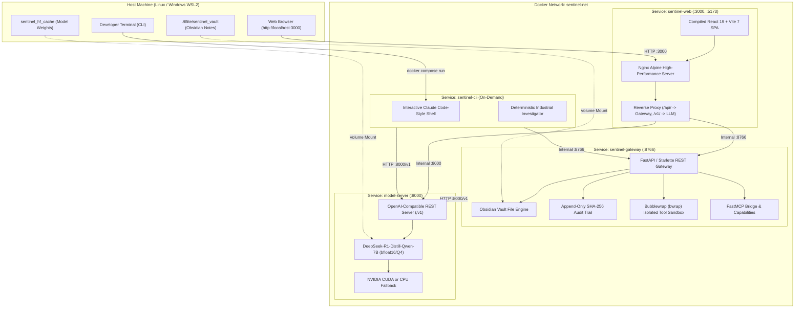

# 🛡️ SENTINEL — Sovereign Autonomous Agent Containerization Guide

This guide details the complete containerization architecture for **SENTINEL: Sovereign On-Premise Industrial AI Workbench & Agent** (SIH 2026 Problem Statement #26117).

---

## 🏗️ Architecture Overview

SENTINEL runs as an air-gapped, sovereign multi-service container mesh orchestrated via Docker Compose:



---

## 📦 Services Breakdown

| Service Name | Port Mapping | Description | Healthcheck Endpoint |
| :--- | :--- | :--- | :--- |
| **`sentinel-web`** | `3000:80`, `5173:80` | Production Nginx hosting Vite SPA with zero-CORS proxying | `GET /healthz` |
| **`sentinel-gateway`** | `8766:8766` | FastMCP bridge, Bubblewrap sandbox, and Obsidian Vault server | `GET /health` |
| **`model-server`** | `8000:8000` | Local OpenAI-compatible server running DeepSeek-R1-Distill-7B | `GET /health` |
| **`sentinel-cli`** | Interactive | Claude Code-style interactive agent terminal shell | N/A |
| **`watcher`** | Background | Autonomous telemetry anomaly monitoring daemon | N/A |

---

## 🚀 Quickstart

### 1. Ensure Docker is Running
```bash
# If the Docker daemon is not active on your system:
sudo systemctl start docker
```

### 2. Launch the Full Sovereign Stack

#### Standard Mode (CPU / Automatic Detection)
```bash
docker compose up -d
```

#### GPU-Accelerated Mode (NVIDIA RTX 4050 6GB / CUDA)
```bash
docker compose -f docker-compose.yml -f docker-compose.gpu.yml up -d
```

### 3. Open the Sovereign Console
Open your browser to:
- **`http://localhost:3000`** (or `http://localhost:5173`)

You will see:
1. **Sovereign Persona Authentication**: Select clearance level (Operator, Technician, Reliability Engineer, Plant Manager, SOC Admin).
2. **Obsidian Knowledge Vault**: Real-time markdown workspace, note inspector, and [[wikilink]] navigation.
3. **DeepSeek-R1 Agent Workspace**: Interactive Claude Code-style agent with native `<think>` Chain-of-Thought accordions.
4. **1-Click Quick Inquiries & Dummy Queries**: Instantly test greetings (`👋 Hello Sentinel`), cluster health (`⚡ Cluster Diagnostics`), ISO standards (`📊 ISO Limits`), and forensic investigations (`🔍 Slurry Pump P-204`).
5. **D3 Knowledge Graph**: 3D/2D physics simulation of plant assets and incident linkages.
6. **Reasoning Ledger**: ISO 10816-3 deterministic verification audit ledger with CAS SHA-256 integrity seal.

---

## 💻 Interactive Terminal CLI

Run the sovereign agent directly in your terminal inside the container:

### 💬 Interactive Chat
```bash
docker compose run --rm sentinel-cli chat
```

### 🔍 Automated Industrial Investigation
```bash
docker compose run --rm sentinel-cli investigate "Analyze Pump P-204 vibration drift and compare with ISO 10816-3 limits"
```

### 🩺 System Diagnostics & Doctor
```bash
docker compose run --rm sentinel-cli doctor
```

---

## 🔒 Security & Sandbox Isolation

1. **Bubblewrap Linux Namespaces**:
   - The `sentinel-gateway` container runs with `cap_add: [SYS_ADMIN]` to allow Bubblewrap (`bwrap`) to create isolated, unprivileged, zero-network user/mount namespaces for tool execution.
   - Seed tools (`grep`, `pdftotext`, `tesseract`, `pandas`, `convert`) run with read-only root mounts and dropped privileges.

2. **Zero Cloud Egress**:
   - All network calls are strictly restricted to the internal Docker bridge network `sentinel-net`.
   - External model APIs and telemetry reporting are disabled by design.

3. **Persistent Vault & Audits**:
   - Obsidian notes are stored on the host under `./tflite/sentinel_vault` and live-mounted into the containers. Any notes created or modified by the agent are immediately readable by desktop Obsidian!

---

## 🛠️ Management & Maintenance

### View Container Logs
```bash
# All services
docker compose logs -f

# Specific service
docker compose logs -f sentinel-web
docker compose logs -f sentinel-gateway
docker compose logs -f model-server
```

### Check Service Health
```bash
docker compose ps
```

### Stop the Stack
```bash
docker compose down
```

### Stop & Clear Volumes
```bash
docker compose down -v
```
