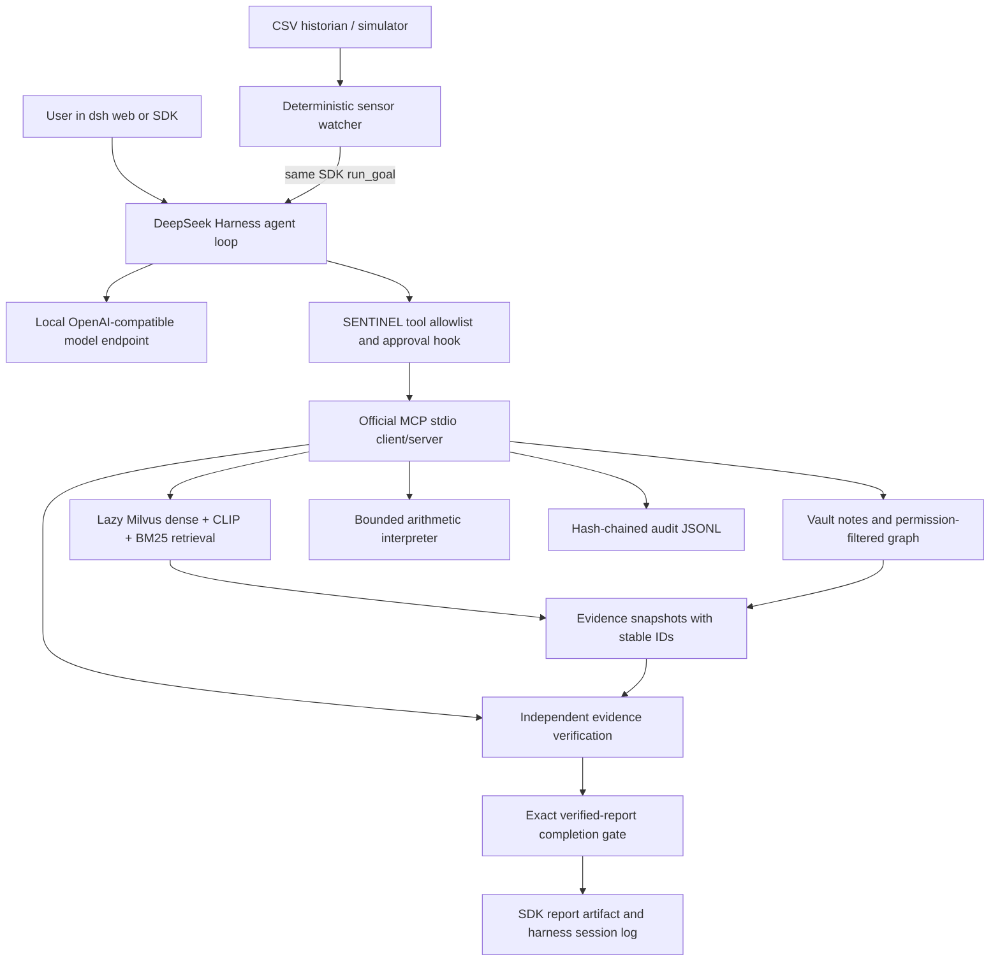

# SENTINEL RAG ↔ DeepSeek Harness

SENTINEL uses the checked-in DeepSeek Harness for agent turns, local inference, approval prompts, tool traces and session persistence. Python owns retrieval, the permission-filtered vault graph, sensor history, bounded arithmetic and independent verification. The MCP bridge does not instantiate `SentinelWorkbench` or load its generative model; doing so would duplicate the harness's reasoning loop.



## Start

Commands below run from the repository root. Python 3.10+ is required; this checkout was tested with Python 3.14. Linux is required for the service's cross-process file locks.

```bash
python3 -m venv .venv
.venv/bin/pip install -r RAG/requirements-harness.txt
```

Use the checked-in harness, whose current APIs are newer than the published npm release tested during development. Prepare it using its declared pnpm version (11.7.0), Node version and build commands:

```bash
cd tools/deepseek-harness
pnpm install --frozen-lockfile
pnpm run build:native-system
pnpm run build:lib:host
cd ../..
```

`RAG/harness/dsh-source` invokes the supported `dsh --profile` source launcher. It does not replace the SDK's argv or launch an internal SDK application directly. For the browser frontend also run `pnpm run build:lib:client` followed by `pnpm run build:web` inside `tools/deepseek-harness`.

Start an already provisioned local, tool-capable OpenAI-compatible model server (Ollama or vLLM). Configure the endpoint and exact installed model name:

```bash
.venv/bin/python RAG/sentinel_harness.py configure \
  --endpoint http://127.0.0.1:11434/v1 --model qwen2.5:7b
.venv/bin/python RAG/sentinel_harness.py doctor
.venv/bin/python RAG/sentinel_harness.py investigate \
  --dsh-bin "$PWD/RAG/harness/dsh-source" --model qwen2.5:7b
.venv/bin/python RAG/sentinel_harness.py web \
  --dsh-bin "$PWD/RAG/harness/dsh-source"
```

`configure` generates `sentinel.cordis.patch.yml` with absolute paths for this checkout and Python environment. Regenerate after moving the project. It disables the cloud DeepSeek provider, harness telemetry and web search/fetch, registers a local pi-ai route, and mounts the MCP bridge and policy plugin. Use a dedicated `.sentinel-dsh` home; an existing home's user settings can override provider configuration. Local endpoint validation accepts localhost and literal private/loopback IPs and rejects public, unspecified and link-local addresses. Deployment firewall rules remain the authority for network isolation; configuration alone is not a network sandbox.

Local OpenAI-compatible clients require a nonempty authentication value even for unauthenticated servers. The launcher supplies the non-secret `local-no-auth` placeholder; set `SENTINEL_LOCAL_API_KEY` for a local server that requires a real key. The patch references that environment variable without storing its value.

The SDK defaults to a five-minute investigation timeout and a two-minute initialization timeout. Errors are logged and raised; an incomplete response is never saved as a completed report. Successful reports are stored under `RAG/state/report-*.json`. Reuse the same configured role and data directories across the MCP process, SDK runner and watcher. Trusted deployment settings are environment variables; models cannot change the role through tool arguments.

## Retrieval and ingestion

The light bridge works immediately with the supplied Markdown vault and CSV historian. Default `hybrid` mode attempts the existing `rag.load_data`, embedding loader and `rag.retrieve` on the first search. Missing Milvus/ML dependencies or an unavailable index produce an explicitly labeled `vault-keyword` fallback. `--retrieval vault` selects that mode deliberately. There is no silent model download or automatic ingestion during MCP startup.

Provision retrieval dependencies and cache the embedding/CLIP models before disconnecting the network. Python/platform support for PyTorch, Milvus Lite and BitsAndBytes varies; use an environment supported by the selected packages. The full existing dependency list also contains standalone generative-inference dependencies, which the MCP bridge itself does not need.

```bash
.venv/bin/pip install -r RAG/requirements.txt
.venv/bin/python RAG/embeddings.py --domain industrial \
  --vault-dir "$PWD/RAG/sentinel_vault" --output-dir "$PWD/RAG/index_store" \
  --spreadsheet "$PWD/RAG/data/pump_p204_vibration_history.csv"
```

Ingest additional PDFs with `--pdf /absolute/document.pdf`; optional Docling extraction produces drawing/page assets. `analyze_equipment_drawing` returns the indexed image through MCP, with its source metadata, for a vision-capable harness model. It does not pretend a text model can inspect images. Without an indexed image the result says `unavailable`. Configure a vision-capable model's `input: [text, image]` in the local route when that capability is actually served. Asset reads stay inside the index directory and are bounded to 5 MB.

## Tool contracts

| Tool | Behavior |
| --- | --- |
| `search_documents(query, top_k=5)` | Hybrid retrieval or explicitly degraded vault search; returns issued evidence IDs and source metadata. |
| `read_document(evidence_id)` | Reads the exact retrieved chunk/page, not an arbitrary host file. |
| `read_vault_note(note_title)` | Resolves a unique title, vault-relative title or equipment tag; returns content and file SHA-256. |
| `get_vault_backlinks(entity_id)` | Returns backlinks among readable notes. |
| `traverse_graph(entity_id, depth=2)` | Bounded bidirectional traversal; inaccessible and dangling nodes are excluded. |
| `analyze_equipment_drawing(evidence_id)` | Returns an indexed drawing image and provenance, or an explicit unavailable result. |
| `calculate_metric(formula, operands, formula_name)` | Evaluates bounded arithmetic without `eval`, imports, attributes, shell or general Python execution. |
| `query_sensor_history(equipment_id, limit=100)` | Reads equipment-authorized CSV history with exact row provenance. |
| `verify_evidence(report)` | Checks quotes against server-held sources, numeric operands, arithmetic, explicit measurement conflicts and recommendation policy. |
| `request_capability(capability_name, input_data)` | Validates and executes registered OS utilities; authorized unknown requests generate sandbox-tested proposals requiring admin approval. |
| `write_vault_note(note_title, content, expected_sha256)` | Writes only `Investigations/<title>.md`, after harness approval, for engineer/manager/admin roles; rejects stale versions. |

MCP names are `mcp__sentinel__<tool>`. Every executed call is audited. Source role labels follow the original role ladder; `public`, `internal`, `confidential`, and `restricted` map to levels 1, 2, 4, and 6. Unknown roles/labels fail closed. The existing RAG dense, sparse and visual branches all apply the same clearance helper.

## Verification and approval

The model submits a structured report to `verify_evidence`. Example fields:

```json
{
  "executive_summary": "Inspection reports elevated vibration.",
  "evidence": [{"evidence_id": "<issued-id>", "quote": "<exact source quotation>"}],
  "calculations": [{
    "formula": "(current-baseline)/baseline*100",
    "operands": {"current": 5.4, "baseline": 2.8},
    "claimed_result": 92.857142857,
    "operand_evidence": {
      "current": {"evidence_id": "<issued-id>", "quote": "<quotation containing 5.4>"},
      "baseline": {"evidence_id": "<issued-id>", "quote": "<quotation containing 2.8>"}
    }
  }],
  "actionable_recommendations": ["Request reliability-engineer review."]
}
```

A successful result returns `report` with a server-generated `verification` section. The final assistant response must be exactly that report JSON, including verification, without fences or later-added claims. The policy plugin checks this at `agent/turn-stopping`; an absent, failed, stale-turn or changed report makes the turn fail. The SDK independently checks it again before saving a completed report. The harness may already have streamed provisional assistant text before the completion gate; its final turn state and the SDK artifact are authoritative.

Verification proves exact quotations, source-local operand values and arithmetic. It does **not** prove semantic entailment of a free-form executive summary or provide a calibrated confidence score. Conflicting values are detected for evidence items with the same `parameter`, `measurement_time` and `measurement_point`; broad semantic contradiction discovery remains outside this implementation. Human judgment is required for industrial recommendations. The bundled SOP thresholds are demo data, not an independently validated engineering standard.

Reads and calculations run automatically. Writes ask through the real harness approval service; approval displays the exact destination title, content and expected prior hash. Without an answerer, SDK/unattended writes fail closed. A model-supplied `approved=true` cannot grant authority. The server's `SENTINEL_HARNESS_WRITES=1` setting is only for the controlled harness transport; direct MCP launches default to no writes. Only generated investigation notes may be written; original evidence and arbitrary paths are not mutable through the tool. A fresh note uses an empty expected hash; updates use the SHA-256 returned by a fresh note read. A concurrent change requires another read and approval.

All other model tools—including shell, filesystem export, web access, delegation, code transports and plugin modification—are blocked by a monotonic harness guard. This prevents a model from bypassing retrieval RBAC or editing the approval configuration through another harness tool. The supplied profile is an industrial investigation profile, not a general coding-agent profile. Policy decisions and approval outcomes also remain in harness JSONL sessions.

## Proactive investigation

The watcher reads the same historian adapter as the MCP tool. It checks each measurement point's latest reading against an absolute threshold and the average of the previous N readings, without an LLM. A stable alert ID, transactional claim and persisted status suppress duplicate launches across restarts and concurrent processes. Failed dispatches require `--retry-failed`; a process crash leaving a `running` alert requires operator review before retrying, to avoid duplicating an investigation whose outcome is unknown.

```bash
.venv/bin/python RAG/sentinel_watcher.py --dry-run
.venv/bin/python RAG/sentinel_watcher.py --once \
  --dsh-bin "$PWD/RAG/harness/dsh-source" --model qwen2.5:7b
.venv/bin/python RAG/sentinel_watcher.py --interval 5 \
  --dsh-bin "$PWD/RAG/harness/dsh-source" --model qwen2.5:7b
```

For a visibly changing synthetic historian, set `SENTINEL_DATA_DIR` to an isolated demo directory in both terminals, regenerate the patch with that environment, then run the simulator and watcher together:

```bash
export SENTINEL_DATA_DIR="$PWD/RAG/state/demo-data"
.venv/bin/python RAG/sentinel_harness.py configure --model qwen2.5:7b
.venv/bin/python RAG/sentinel_simulator.py --data-dir "$SENTINEL_DATA_DIR"
# In a second terminal with the same SENTINEL_DATA_DIR:
.venv/bin/python RAG/sentinel_watcher.py --dsh-bin "$PWD/RAG/harness/dsh-source"
```

The simulator publishes two assets through atomic CSV replacements: P-204 drifts after five stable samples, while C-104 remains stable. Every row is explicitly labeled synthetic. It does not modify the bundled historical CSV or control equipment. Use the existing harness session trace to inspect the automatically launched investigation; a custom live telemetry dashboard is a separate UI feature.

The supplied CSV's latest reading is 5.4 mm/s; commissioning was 2.8, the immediately previous reading was 4.4, and the previous three-reading average was 3.8. Those imply approximately 92.86%, 22.73%, and 42.11% increases respectively. The alignment document's earlier 4.2 baseline example is not used. CSV history is demo telemetry, not live plant data. A production historian adapter should preserve equipment, measurement point, timestamp, units and source provenance.

## Validation and deployment limits

```bash
.venv/bin/pip install pytest
.venv/bin/pytest -q RAG/tests
node --test RAG/harness/policy.test.mjs
.venv/bin/python RAG/tests/smoke_harness.py
.venv/bin/python RAG/tests/smoke_web.py
```

The smoke test runs the real dsh profile, Python SDK, local pi-ai adapter and MCP child process against a scripted loopback SSE model. It tests both typed and sensor-triggered entry points and rejects an altered final report without a cloud API key. The web smoke boots the real web profile and checks that it serves the built UI. It is an integration test, not a model-quality or GPU-capacity benchmark. Subprocess IPC and loopback binding must be available to the test environment.

Runtime state is ignored by Git. The audit is hash-chained and fsynced under file locks, making edits detectable if the trusted chain tip is preserved; it is **not** immutable storage against a host administrator. Production deployment still needs authenticated user-to-role mapping, a separate service identity per trust boundary, encrypted storage, retention policy, network egress controls and off-host/WORM audit anchoring. These are deployment responsibilities, not claims satisfied by a YAML patch. Dedicated three-panel SENTINEL UI/AI Canvas rendering, organization rollups and the architecture's roadmap-only differentiators are not added to the upstream harness.

## OS capabilities

See [CAPABILITIES.md](CAPABILITIES.md) for the config-driven OS utility registry,
offline sandbox requirements, structured MCP interface, and audit verification.
